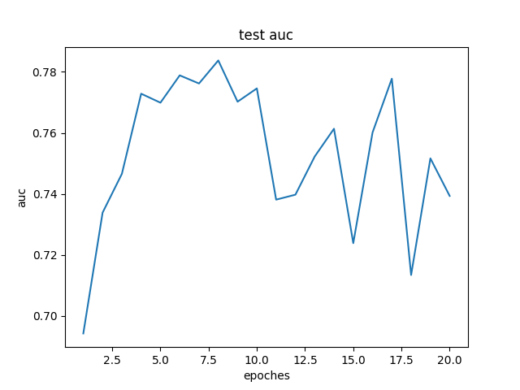
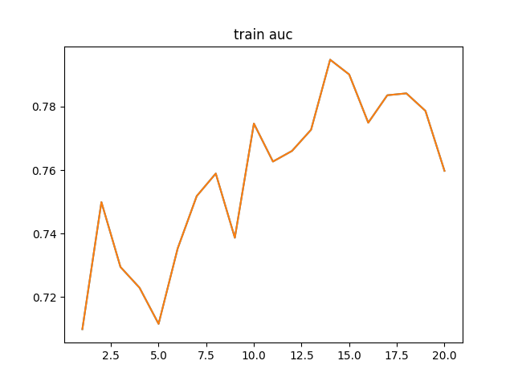
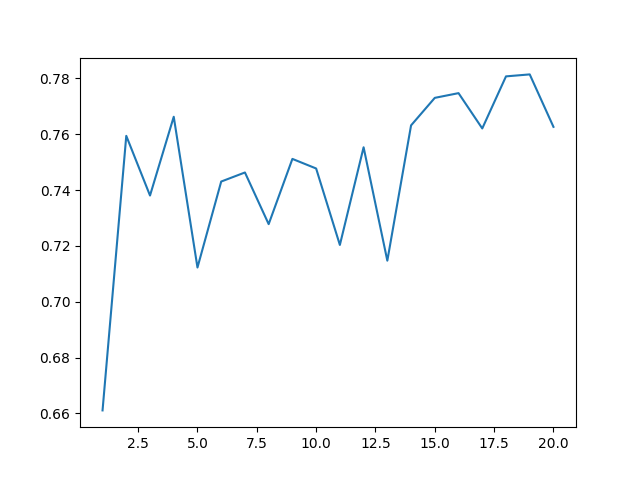
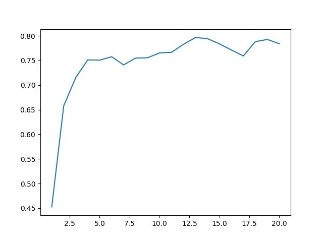
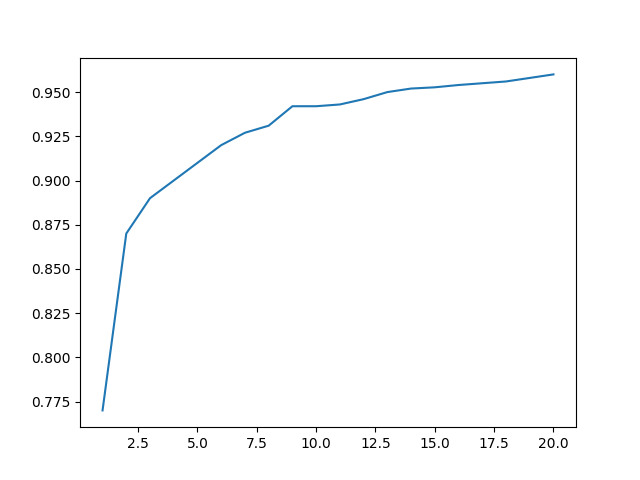
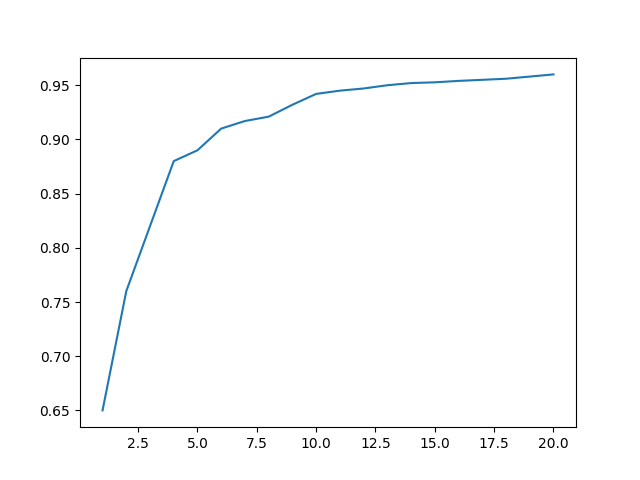

#### DPSGD on Census (KDD)

1 layer, 64 neurals, $C=4$, $\sigma=1$

1 test run (each)

average over 5 runs (each)

#### averaging gradient norms on Census (no privacy)

$C=\text{average of norms of previous epoch}$

1 test run

#### AdaClip on normal MNIST 

$\epsilon = 1, \sigma=10^{-5}, 100 neurals$

DPSGD

AdaClip

(no much difference)

#### Next

- AdaClip on Census
